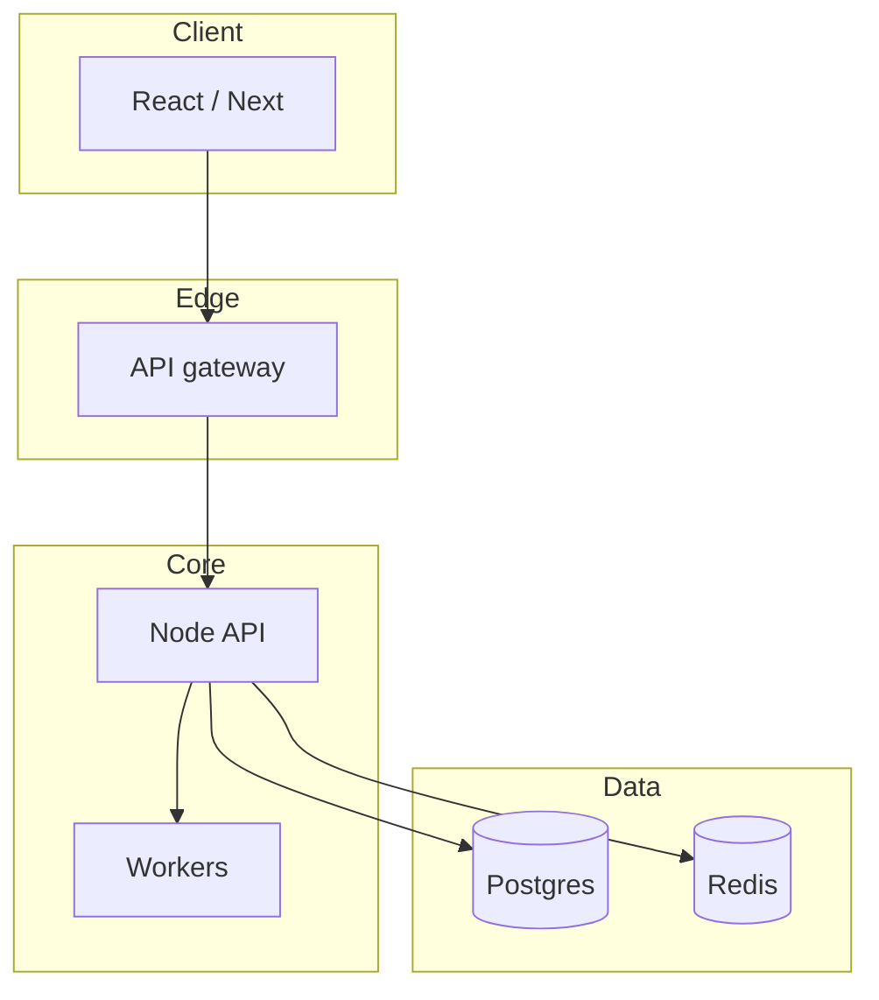

# Explainer

Turn questions into a living, **visual HTML** explainer. Get to the point, lead with diagrams, show the **big picture** (and for tech: the **stack** — everything that comes together). Focus on **how things should work**, especially over time.

Composes with **`html-design`** and **`frontend-design`** for polish. Explainer owns structure and content; load those for look-and-feel. Don't restate them.

**The density bar in `html-design` applies here too** — it is a content rule, not a styling one. This user's standing complaint is that these pages come out too verbose. Diagrams **replace** prose, they don't accompany it: ≤2 sentences under each one, tables instead of paragraphs, no preamble, no boilerplate Overview/Conclusion sections, and a subtraction pass before showing. In session mode this matters more each turn — appended Q sections accumulate, so keep every one tight and re-trim the Big picture instead of letting it grow.

**Install note:** Canonical copy lives at `~/.claude/skills/explainer/`. Symlink into Codex + Cursor via `bash ~/.claude/skills/explainer/sync.sh` so one edit updates Claude Code, Codex, and Cursor.

## Non-negotiable: every answer ships / updates HTML

A chat-only answer is a **failed run.** No exceptions.

- Write **one self-contained `.html`**. Inline CSS + JS; CDN for Mermaid is fine.
- **Path default:** user-named path → else `explainers/<slug>.html` in a repo → else `./explainer-<slug>.html`.
- **Start from `template.html`** in this skill folder on first create.
- **Chat reply = path + gist only.** No pasted diagrams.

Chat reply shape:
> Updated `explainers/checkout.html` — added how retries interact with PricingService; open for the stack + diagrams.

## Session mode (critical)

Once this skill is invoked in a conversation, **stay in explainer mode** until the user clearly ends it ("new explainer", "start fresh", "stop explaining", or switches to unrelated implementation work).

| Turn | Action |
| --- | --- |
| **First question** | Create the HTML from `template.html`. Fill Title, Big picture, Stack (if tech). Answer the question in its own section. |
| **Every follow-up question** | **Update the same file.** Do not create a new HTML per question. Append a new **Question** section with diagrams. Refresh Big picture / Stack / gist if the new answer changes the overall model. |
| **New explainer** | Only when asked — new file, new slug. |

Track the active path in the conversation. Put it in the HTML too:

```html
<meta name="explainer-file" content="explainers/checkout.html" />
<meta name="explainer-session" content="active" />
```

Each answered question becomes a dated/numbered block under `#questions` so the page is a running explainer notebook, not a one-shot doc.

## When to use

- Explain a concept, pattern, or system
- Map a codebase / module / feature
- Show **what comes together** (stack, services, libs, layers)
- Architecture / component relationships
- Flows, lifecycles, motion / interaction

**Not this skill:** implementing product fixes, auditing motion (`improve-animations`), naming effects (`animation-vocabulary`).

## Operating rules

1. **HTML is mandatory** — create or update the file every turn in session mode.
2. **Accumulate** — follow-ups append; they don't replace prior Q sections (unless the user asks to revise a specific answer).
3. **Lead with diagrams.** 1–3 sentences per diagram; bullets over paragraphs.
4. **Every concept ships a concrete example.** No abstract definition stands alone — see *Always ground it in an example*.
5. **One idea per diagram.** Split overloaded pictures.
6. **Name real things** from the codebase / real stack — never `ServiceA` / `Utils`.
7. **Show time when it matters** — sequence / state / timeline, not only boxes.
8. **Default to "how it should work."** Note as-is drift in one line if relevant.
9. **Explain, don't refactor** product code.

## Workflow

### 1 · Scope

| Kind | Goal | Primary diagram |
| --- | --- | --- |
| Concept | Mental model | `flowchart` |
| Architecture | Structure + boundaries | `flowchart` + subgraphs |
| **Stack / tech** | What comes together | stack diagram (layers or clustered components) |
| Codebase / feature | Who calls what | module map + key path |
| Flow / lifecycle | Order of events | `sequenceDiagram` |
| Motion / interaction | States, triggers, timing | `stateDiagram-v2` + timeline |

One clarifying question only if scope is genuinely ambiguous.

### 2 · Recon (code / tech)

Just enough — no file-tree dumps:

- Entry points + hot path
- Where state lives / who owns side effects
- **Stack inventory** (languages, frameworks, services, queues, DBs, third parties that actually participate)
- For motion: trigger, states, interruptibility, reduced-motion path

### 3 · Page information architecture

| Section | Status | Contents |
| --- | --- | --- |
| **Title + gist** | Required | Plain title + 1–2 sentence summary (update as session grows) |
| **Big picture** | Required | Overall mental model diagram + 2–4 bullets — the whole system at a glance |
| **Examples** | Required | Not always its own section — but every concept above must carry a concrete instance |
| **Stack** | Required for tech | Everything that comes together: languages, frameworks, services, infra, key libs — as a diagram + short table |
| **How it works** | If there's a core flow | Main-path sequence / state |
| **Motion / interaction** | If motion matters | trigger → states → settle + timeline (+ optional live demo) |
| **Key pieces** | Codebase | `path/symbol` → one-line role |
| **Questions** | Required after first Q | Running log: each user question → diagram-first answer |
| **Gotchas** | If any | Races, ownership edges, what must not animate |

**Big picture** = the forest. Keep it current as new questions land; it should still fit in one diagram (≤ ~12 nodes).

**Stack** (tech topics) — show how the pieces compose, not a laundry list of every dependency:



Plus a tight table:

| Layer | Piece | Role |
| --- | --- | --- |
| Client | React | UI + local interaction |
| API | `services/checkout` | Orchestrates payment |
| Data | Postgres | Source of truth |

Omit Stack for pure non-tech concepts (e.g. "what is eventual consistency" can stay concept-only unless tools/systems are in play).

**Questions log** — for each user question in the session:

```html
<article class="q" id="q-3">
  <h3>Q3 · How do retries work?</h3>
  <figure><!-- diagram --></figure>
  <ul><!-- 2–4 bullets --></ul>
</article>
```

Newest question can go at the top or bottom of `#questions` — pick one order and keep it consistent in the file (default: **newest at top**).

### 4 · Stop (per turn)

After updating the HTML: path + gist. Stay ready for the next question. Don't auto-expand beyond what the latest question needs.

## Always ground it in an example

A definition the reader can't picture is not an explanation. **Every concept, rule, and classification gets at least one concrete, named example** — and examples are cheap in words, so they are the *first* thing to add and the *last* thing to cut.

| Rule | Do |
| --- | --- |
| **Concrete over generic** | "beef tenderloin in a steak meal", not "a raw material" |
| **Real numbers** | show the arithmetic: `$135,000 ÷ $90,000 = 150%` |
| **One per branch** | every cell of a 2×2, every arm of a fork, every state gets its own example |
| **Counter-example where the rule surprises** | the case that looks like it should fall the other way and doesn't |
| **Same running example throughout** | pick one domain and reuse it, so the reader carries context between sections |
| **Label the made-up ones** | "illustrative figures" when they aren't from the source |

Examples belong **inside the diagram** where they fit — a node labelled `Beef tenderloin` teaches more than a node labelled `Direct material` with a caption underneath. Otherwise put them in an examples table right under the diagram.

**Checklist before shipping:** every abstract noun on the page has a concrete instance within one screen of it. If a section defines something and never shows it, that section is unfinished.

## Diagrams

Mermaid by default; hand SVG only for a true hero diagram. Theme via **`html-design/references/diagrams.md`** — never default purple.

| Need | Prefer |
| --- | --- |
| Big picture / architecture | `flowchart` + subgraphs |
| Stack / what comes together | `flowchart` TB with layer subgraphs |
| Call / event order | `sequenceDiagram` |
| UI / motion states | `stateDiagram-v2` + timeline table |
| Data shape | `erDiagram` |

Hygiene: ≤ ~12 nodes; spoken-aloud labels; one accent path; one-line caption; themeVariables match page tokens.

## Explaining motion

Intended behavior only — **trigger → states → settle**. Always name **interruptibility** and **reduced motion**. Timeline table only with known durations (else describe feel). Optional live demo in `template.html`.

## Examples

- **Session** — User: `/explainer how does checkout work?` → create HTML with Big picture + Stack + Q1. User: "what about retries?" → same file, refresh Big picture if needed, add Q2 with diagram. User: "how should the success toast animate?" → add Motion section + Q3.
- **Concept** — "Explain event sourcing" → Big picture flowchart; Stack omitted.
- **Stack** — "What's the stack for this app?" → Stack section is the hero; Big picture shows how layers connect.

## Anti-patterns

- Chat-only answer / no file update on a follow-up question
- New HTML file per question in the same session
- Skipping Big picture, or letting it go stale after new answers
- Tech explainer with no Stack / "what comes together" view
- Dependency dump (`lodash`, `left-pad`) instead of the real composing pieces
- Mega-diagram mixing structure + sequence + timing
- Generic box names; invented durations; default Mermaid purple
- A concept defined but never shown — no example, or a placeholder example (`foo`, `a resource`)
- Naming a distinction (A vs B) without explaining what actually separates them
- Grading motion quality; refactoring product code; pasting long summaries into chat
